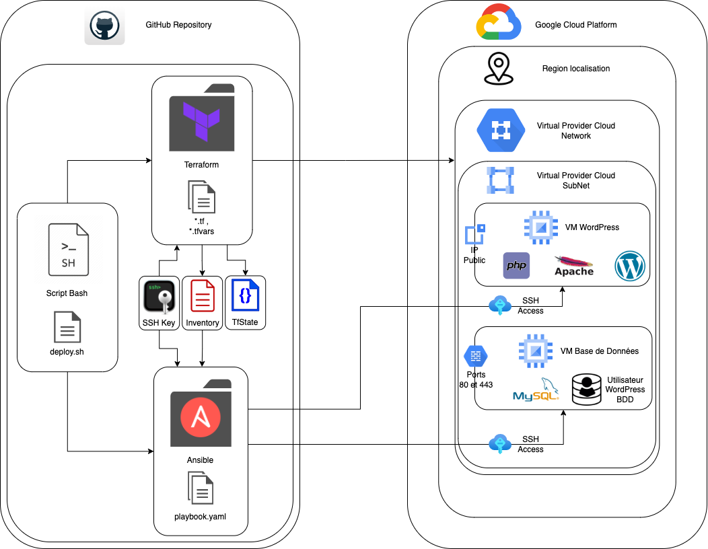

# TP1-VM_WORDPRESS

Documentation du Déploiement Automatisé d'un site WordPress sur Google Cloud Platform (GCP)

## Description des fichiers fournis

``` sh
. # Arborescence du repository
├── README.md
├── ansible
│   ├── ansible.cfg
│   ├── inventory.ini
│   ├── playbook.yml
│   ├── roles
│   │   ├── database
│   │   │   ├── handlers
│   │   │   │   └── main.yml
│   │   │   └── tasks
│   │   │       └── main.yml
│   │   └── wordpress
│   │       ├── handlers
│   │       │   └── main.yml
│   │       ├── tasks
│   │       │   └── main.yml
│   │       └── templates
│   │           └── wp-config.php.j2
│   └── vars.yml
├── creation-inventory.sh
├── credentials.json
├── deploy.sh
├── deployment-schema
│   └── deployment-wordpress-gcp.drawio.png
├── ssh_keys
├── terraform
│   ├── db_vm
│   │   ├── main.tf
│   │   ├── outputs.tf
│   │   └── variables.tf
│   ├── firewall
│   │   ├── main.tf
│   │   ├── outputs.tf
│   │   └── variables.tf
│   ├── main.tf
│   ├── outputs.tf
│   ├── service_account
│   │   ├── main.tf
│   │   ├── outputs.tf
│   │   └── variables.tf
│   ├── terraform.tfstate
│   ├── terraform.tfstate.backup
│   ├── variables.tf
│   ├── vpc
│   │   ├── main.tf
│   │   ├── outputs.tf
│   │   └── variables.tf
│   └── wordpress_vm
│       ├── main.tf
│       ├── outputs.tf
│       └── variables.tf
├── terraform-destroy.sh
├── terraform.tfstate
└── tp_1_VM_WORDPRESS.pdf
```

* `README.md` : Le fichier que vous lisez actuellement, qui contient la documentation du projet.
* `ansible` : Le répertoire contenant les fichiers et les rôles Ansible pour le déploiement de votre application.
* `creation-inventory.sh` : Un script pour générer un fichier d'inventaire Ansible à partir de votre infrastructure.
* `credentials.json` : Fichier de configuration contenant des informations d'identification pour se connecter a votre compte GCP
* `deploy.sh` : Un script pour déployer votre application en utilisant Terraform et Ansible.
* `deployment-schema` : Le répertoire contenant des schémas de déploiement.
* ``ssh_keys`` : clés SSH pour l'infrastructure.
* ``terraform`` : Le répertoire contenant les fichiers Terraform pour le déploiement de votre infrastructure.
* ``terraform-destroy.sh`` : Un script pour détruire l'infrastructure créée avec Terraform.
* ``tp_1_VM_WORDPRESS.pdf`` : Sujet du TP sous format PDF

## Description des pré-requis

Pour exécuter ce projet avec succès, vous devez vous assurer de disposer des éléments suivants :

* Un ordinateur avec ``Ansible`` et ``Terraform`` installé.
* Un ``compte GCP`` avec les autorisations appropriées pour créer des machines virtuelles (VM) et des réseaux VPC.
* Une ``clé SSH`` publique nécessaire pour accéder à vos machines virtuelles déployées
* Un fichier ``"credentials.json"`` que vous aurez télécharger depuis la console GCP et stockée a la racine de votre dossier
* La ``configuration de Google Cloud SDK`` : Assurez-vous que vous avez configuré Google Cloud SDK avec vos informations d'identification GCP. Cela vous permettra d'interagir avec votre projet GCP via la ligne de commande.

## Schéma de présentation du déploiement

Voici le schéma permettant de visualiser le flux et l'inter-connection des différents ressources et services :



L'architecture comprend deux machines virtuelles (VM), une pour ``WordPress`` et une autre pour la ``base de données MySQ``L`` :

* La machine ``WordPress`` est accessible publiquement et contient PHP, Apache et l'application WordPress.
* La machine de base de données n'est pas accessible publiquement et contient MySQL avec un utilisateur spécifique pour WordPress.

## Composition et Configuration du dossier Ansible

- ``ansible.cfg`` : Ce fichier contient la configuration globale d'Ansible pour le projet. Il inclus des paramètres tels que les chemins vers les fichiers d'inventaire, les rôles par défaut, et d'autres options de configuration spécifiques à Ansible.

- ``inventory.ini`` : Le fichier "inventory.ini" est notre inventaire Ansible. Il répertorie les serveurs ou les hôtes que nous souhaitons gérer avec Ansible. Les adresses IP et  les noms d'hôte de nos machines virtuelles sont spécifiés dans ce fichier.

- ``playbook.yml`` : Le fichier "playbook.yml" est le playbook Ansible principal pour ce projet. Il contient une liste d'actions à exécuter sur les hôtes répertoriés dans l'inventaire. Toutes les tâches spécifiques que nous souhaitons automatiser sont définies dans ce playbook.

- ``roles`` : Le répertoire "roles" contient les rôles Ansible qui définissent les actions à effectuer dans notre infrastructure. Nous avons deux rôles : "database" et "wordpress". Chaque rôle comprend des répertoires "handlers" pour les gestionnaires d'événements, "tasks" pour les tâches spécifiques, et parfois "templates" pour les fichiers de modèle.
    - **roles/database** : Ce rôle est chargé de la configuration de la base de données. Il comprend des tâches telles que l'installation et la configuration d'un serveur de base de données.
    - **roles/wordpress** : Ce rôle gère la configuration de l'application WordPress. Il inclut des tâches telles que le déploiement de fichiers WordPress et la configuration de l'application.

- ``vars.ym`` : Le fichier "vars.yml" est un fichier de variables Ansible. Il contient des variables globales et spécifiques au rôle qui peuvent être utilisées dans les playbooks et les tâches Ansible. **== CONFIGURABLE**

## Composition et Configuration du dossier Terrafrom

- ``db_vm`` : Ce répertoire contient les fichiers spécifiques à la création d'une machine virtuelle pour la base de données.
    - **main.tf** : Ce fichier définit la configuration principale pour la création de la machine virtuelle de la base de données, y compris les détails tels que le type de machine, l'image, et les paramètres réseau.
    - **outputs.tf** : Ce fichier définit les sorties (outputs) que vous souhaitez obtenir après la création de la machine virtuelle de la base de données.
    - **variables.tf** : Ce fichier contient les déclarations de variables spécifiques à la création de la machine virtuelle de la base de données **== CONFIGURABLE**

- ``firewall`` : Ce répertoire contient les fichiers pour la configuration des règles de pare-feu.
    - **main.tf** : Ce fichier définit la configuration des règles de pare-feu pour votre infrastructure.
    - **outputs.tf** : Il définit les sorties liées aux règles de pare-feu.
    - **variables.tf** Ce fichier contient les déclarations de variables spécifiques aux règles de pare-feu **== CONFIGURABLE**

- ``main.tf`` : Ce fichier principal de Terraform contient la configuration générale du projet, telle que la définition du fournisseur de cloud, et des modules deployés.
- ``outputs.tf`` : Ce fichier définit les sorties globales que vous souhaitez obtenir après le déploiement de l'ensemble de l'infrastructure.

- ``service_account`` : Ce répertoire contient les fichiers liés à la configuration du compte de service.
    - **main.tf** : Il définit la configuration liée au compte de service, généralement utilisé pour gérer les autorisations dans l'infrastructure cloud.
    - **outputs.tf** : Ce fichier définit les sorties liées au compte de service.
    - **variables.tf** : Vous pouvez personnaliser les variables liées au compte de service en fonction de vos besoins.**== CONFIGURABLE**

- **terraform.tfstate** et **terraform.tfstate.backup** : Ces fichiers stockent l'état actuel de votre infrastructure Terraform. Ne les modifiez pas manuellement, car Terraform les gère automatiquement.

- **variables.tf** : Ce fichier principal contient les déclarations de variables globales pour votre projet Terraform. Vous pouvez personnaliser ces variables en fonction de vos besoins spécifiques. **== CONFIGURABLE**

- ``vpc`` : Ce répertoire contient les fichiers spécifiques à la création de votre réseau virtuel (VPC).
    - **main.tf** : Il définit la configuration pour la création du VPC, y compris les sous-réseaux et les règles de sécurité.
    - **outputs.tf** : Ce fichier définit les sorties liées au VPC.
    - **variables.tf** : Vous pouvez personnaliser les variables relatives au VPC pour répondre aux exigences de votre projet.

- ``wordpress_vm`` : Ce répertoire contient les fichiers spécifiques à la création de la machine virtuelle pour WordPress, de manière similaire au répertoire "db_vm".

## Composition et Configuration des scripts Bash

* ``creation-inventory.sh`` : Ce script génère un fichier d'inventaire Ansible dynamique à partir de l'infrastructure déployé par Terraform.

* >> deploy.sh : Ce script est le SCRIPT principal pour déployer l'infrastructure.

* terraform-destroy.sh : Ce script est  utilisé pour détruire l'infrastructure que vous avez créée à l'aide de Terraform.

---

## Déploiement de l'infrastructure:

Une fois que vous avez effectué ces modifications des variables pour l'ensemble des dossiers, vous pouvez exécuter les scripts Terraform et Ansible pour déployer et configurer les sites WordPress sur GCP en utilisant la commande suivante :

``` sh
    bash deploy.sh
```

## Script bash deploy.sh pour déployer une infrastructure GCP et une application WordPress

Le script bash `deploy.sh` est un script de déploiement automatisé pour déployer une infrastructure sur Google Cloud Platform (GCP) et déployer une application WordPress à l'aide de Terraform et Ansible.

## Description étape par étape :

### Étape 1/8: Définition et Configuration du projet GCP

* Définit la variable d'environnement `GCP_PROJECT` pour le projet GCP à utiliser.
* Configure le projet GCP en utilisant la commande `gcloud config set project`.

### Étape 2/8: Vérification de la présence de la clé ssh et Génération si nécessaire

* Vérifie si le dossier `.ssh` existe dans le répertoire personnel de l'utilisateur et le crée s'il n'existe pas.
* Vérifie si une clé SSH existe déjà dans le dossier `.ssh` et génère une nouvelle clé si elle n'existe pas.

### Étape 3/8: Vérification de Terraform et Installation si nécessaire

* Vérifie si Terraform est installé, et s'il ne l'est pas, installe Terraform en ajoutant le référentiel HashiCorp et en utilisant `apt` pour l'installation.

### Étape 4/8: Initialisation de Terraform et Création des machines

* Initialise Terraform s'il s'agit de la première exécution du script.
* Utilise Terraform pour créer des machines virtuelles en utilisant le fichier de configuration Terraform.

### Étape 5/8: Génération des inventaires dynamiques Ansible

* Génère un fichier d'inventaire dynamique `inventory.ini` contenant les adresses IP externes des VM déployées par Terraform.
* Met à jour le fichier `vars.yml` avec les adresses IP internes des VM déployées par Terraform.

### Étape 6/8: Vérification de Ansible et Installation si nécessaire

* Vérifie si Ansible est installé, et s'il ne l'est pas, installe Ansible en utilisant `apt`.

### Étape 7/8: Déploiement avec Ansible

* Déploie une application en utilisant Ansible à l'aide du fichier `playbook.yml` en utilisant l'inventaire `inventory.ini`.

### Étape 8/8: Vérification du fonctionnement de l'application

* Effectue une vérification du fonctionnement de l'application WordPress en utilisant `curl` pour accéder à l'adresse IP publique de la VM WordPress.
* Affiche le résultat de la vérification, y compris le titre de la page WordPress.

---

## Destruction de l'infrastructure:

Pour détruire l'infrastructure que vous avez créée à l'aide de Terraform, exécutez le script ``terraform-destroy.sh`` en utilisant la commande suivante :

``` sh
    bash terraform-destroy.sh
```

>> ENJOY !

test