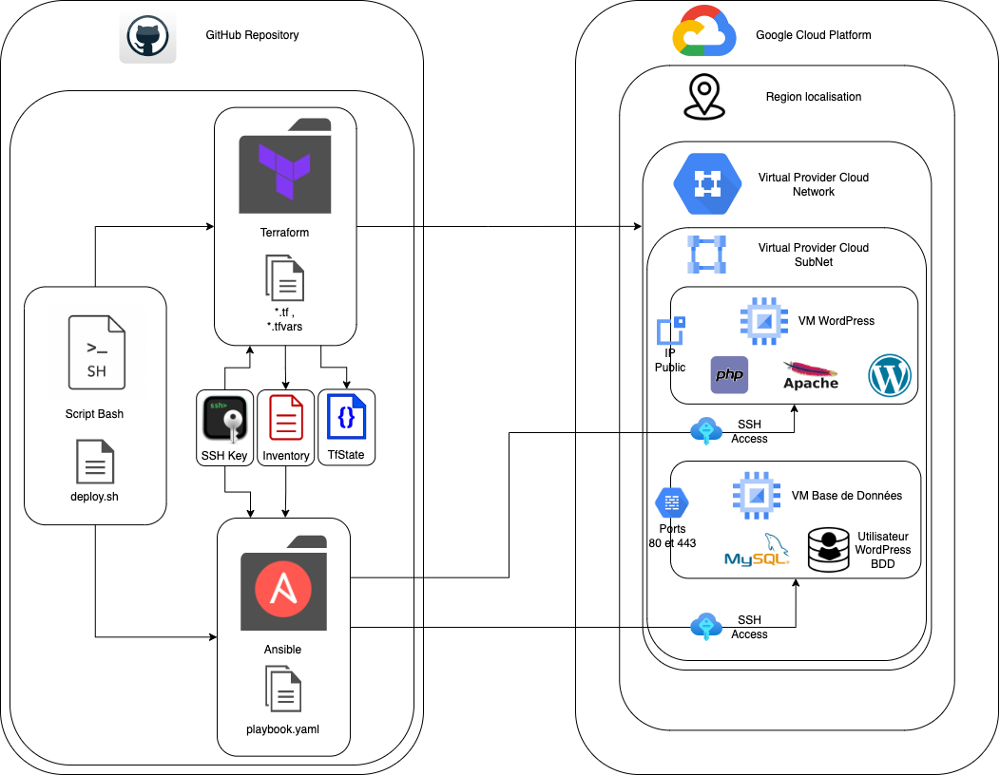

# TP1-VM_WORDPRESS

Documentation du Déploiement Automatisé d'un site WordPress sur Google Cloud Platform (GCP)

## Description des fichiers fournis :

```
.
├── README.md
├── README2.md
├── ansible
│   ├── ansible.cfg
│   ├── inventory.ini
│   ├── playbook.yml
│   ├── roles
│   │   ├── database
│   │   │   ├── handlers
│   │   │   │   └── main.yml
│   │   │   └── tasks
│   │   │       └── main.yml
│   │   └── wordpress
│   │       ├── handlers
│   │       │   └── main.yml
│   │       ├── tasks
│   │       │   └── main.yml
│   │       └── templates
│   │           └── wp-config.php.j2
│   └── vars.yml
├── creation-inventory.sh
├── credentials.json
├── deploy.sh
├── deployment-schema
│   └── deployment-wordpress-gcp.drawio.png
├── ssh_keys
├── terraform
│   ├── db_vm
│   │   ├── main.tf
│   │   ├── outputs.tf
│   │   └── variables.tf
│   ├── firewall
│   │   ├── main.tf
│   │   ├── outputs.tf
│   │   └── variables.tf
│   ├── main.tf
│   ├── outputs.tf
│   ├── service_account
│   │   ├── main.tf
│   │   ├── outputs.tf
│   │   └── variables.tf
│   ├── terraform.tfstate
│   ├── terraform.tfstate.backup
│   ├── variables.tf
│   ├── vpc
│   │   ├── main.tf
│   │   ├── outputs.tf
│   │   └── variables.tf
│   └── wordpress_vm
│       ├── main.tf
│       ├── outputs.tf
│       └── variables.tf
├── terraform-destroy.sh
├── terraform.tfstate
└── tp_1_VM_WORDPRESS.pdf
```

* README.md : Le fichier que vous lisez actuellement, qui contient la documentation du projet.
* ansible : Le répertoire contenant les fichiers et les rôles Ansible pour le déploiement de votre application.
* creation-inventory.sh : Un script pour générer un fichier d'inventaire Ansible à partir de votre infrastructure.
* credentials.json : Fichier de configuration contenant des informations d'identification pour se connecter a votre compte GCP
* deploy.sh : Un script pour déployer votre application en utilisant Terraform et Ansible.
* deployment-schema : Le répertoire contenant des schémas de déploiement.
* ssh_keys : clés SSH pour l'infrastructure.
* terraform : Le répertoire contenant les fichiers Terraform pour le déploiement de votre infrastructure.
* terraform-destroy.sh : Un script pour détruire l'infrastructure créée avec Terraform.
* tp_1_VM_WORDPRESS.pdf : Sujet du TP sous format PDF

## Description des pré-requis :

Pour exécuter ce projet avec succès, vous devez vous assurer de disposer des éléments suivants :

* Un ordinateur avec Ansible et Terraform installé.
* Un compte GCP avec les autorisations appropriées pour créer des machines virtuelles (VM) et des réseaux VPC.
* Une SSH nécessaire pour accéder à vos machines virtuelles déployées
* Un fichier "credentials.json" que vous aurez télécharger depuis la console GCP et stockée a la racine de votre dossier
* La configuration de Google Cloud SDK : Assurez-vous que vous avez configuré Google Cloud SDK avec vos informations d'identification GCP. Cela vous permettra d'interagir avec votre projet GCP via la ligne de commande.

## Schéma de présentation du déploiement :

Voici le schéma permettant de visualiser le flux et l'inter-connection des différents ressources et services :



L'architecture comprend deux machines virtuelles (VM), une pour WordPress et une autre pour la base de données MySQL :
* La machine WordPress est accessible publiquement et contient PHP, Apache et l'application WordPress.
* La machine de base de données n'est pas accessible publiquement et contient MySQL avec un utilisateur spécifique pour WordPress.
